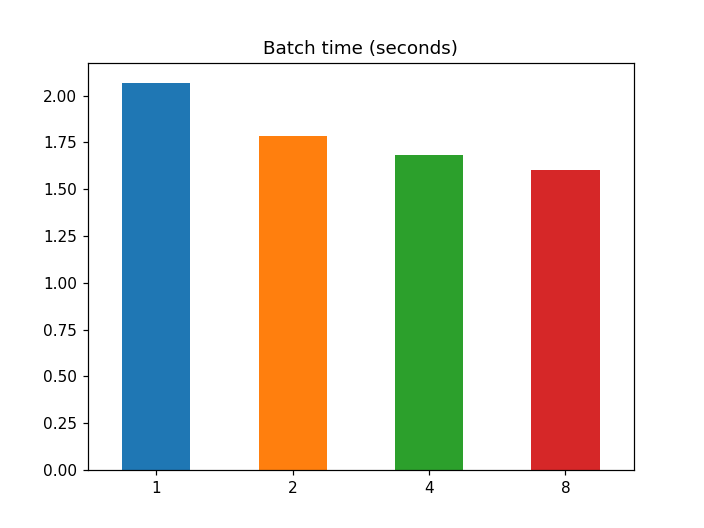
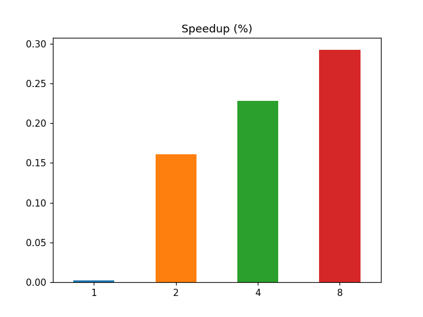
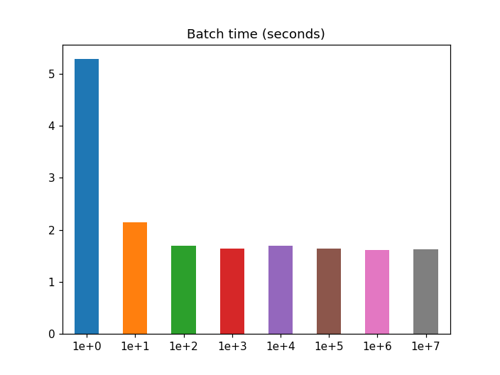
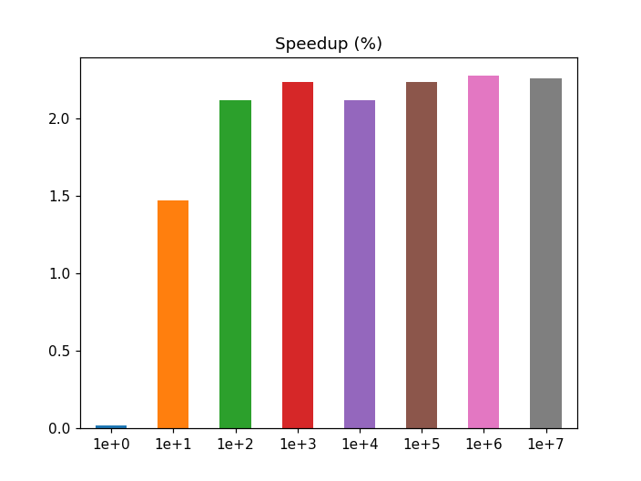

# Speedup Analysis
Performance charts from [speedup_analysis](speedup_analysis.ipynb) Jupyter Notebook.

**Equipment:** Macbook Pro Mid-2012 shipping a Intel(R) Core(TM) i7-3615QM CPU @ 2.30GHz.

## Performance per number of threads

## Performance per batch size

